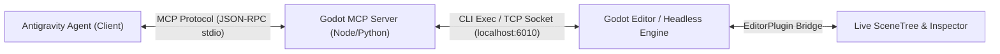

# Godot MCP Server & Tooling Architecture Specification

This specification defines the communication protocol and tool interfaces for connecting an **MCP (Model Context Protocol) Server** and/or a lightweight **Godot Editor Plugin** directly to the AI agent.

---

## 1. Architectural Model



---

## 2. Core MCP Tool Interfaces

A dedicated Godot MCP server implements the following tool definitions for the agent:

### `godot_check_syntax`
* **Description:** Runs Godot in headless check-only mode to statically validate a script or project without opening windows.
* **Input Schema:**
  ```json
  {
    "script_path": { "type": "string", "description": "res:// or relative path to .gd file" }
  }
  ```
* **Command Equivalent:**
  ```bash
  godot --headless --check-only -s <script_path>
  ```

### `godot_run_scene`
* **Description:** Launches a specific scene in debug mode or headless test mode, returning standard output and debugger error strings.
* **Input Schema:**
  ```json
  {
    "scene_path": { "type": "string", "description": "res://path/to/scene.tscn" },
    "headless": { "type": "boolean", "default": false },
    "timeout_seconds": { "type": "integer", "default": 10 }
  }
  ```

### `godot_dump_scene_tree` (Editor Plugin Bridge)
* **Description:** Queries the active Godot Editor via local WebSocket/TCP (port `6010`) to return the exact in-memory hierarchy of nodes, types, and attached scripts for the currently open scene.
* **Returns:** JSON representation of the live SceneTree.

### `godot_reload_scene` (Editor Plugin Bridge)
* **Description:** Programmatically triggers Godot's internal `EditorInterface.reload_scene_from_path(path)` via local IPC, eliminating the need for the human developer to manually click "Reload".

---

## 3. Headless CLI Automation (Available Today)

Even before installing an Editor Plugin, the agent uses Godot's built-in CLI flags:

| Purpose | Command |
| :--- | :--- |
| **Validate GDScript Syntax** | `godot --headless --check-only -s path/to/script.gd` |
| **Run Unit Tests (GUT)** | `godot --headless -s addons/gut/gut_cmdln.gd -gdir=res://test/ -gexit` |
| **Export Project** | `godot --headless --export-release "Linux/X11" build/game.x86_64` |
| **Generate Class Docs** | `godot --doctool . --no-docbase` |
