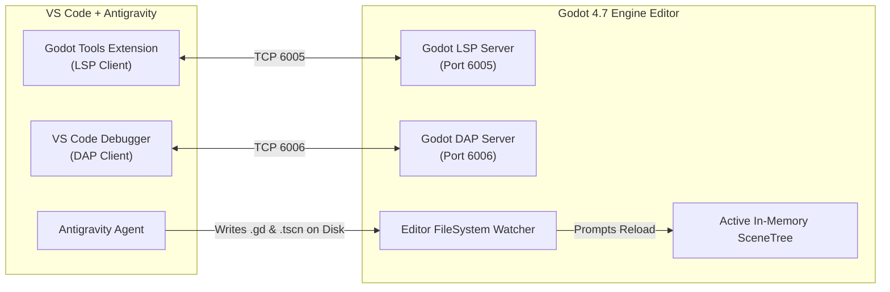

# VS Code & Godot 4.7 Continuous Co-Development Integration

This document defines the configuration and protocol for running **VS Code (with Antigravity)** and the **Godot 4.7 Editor** side-by-side in real-time.

---

## 1. Architecture Overview



---

## 2. Godot Editor Configuration

To enable seamless communication, configure the Godot Editor:

1. **Enable Network Language Server:**
   * Open Godot: **Editor** $\rightarrow$ **Editor Settings** $\rightarrow$ **Network** $\rightarrow$ **Language Server**.
   * `Remote Port`: `6005` (default).
   * `Remote Host`: `127.0.0.1`.
   * `Enable Smart Resolve`: `true`.
   * `Show Native Symbols At Bottom`: `true`.

2. **Enable Debug Adapter (DAP):**
   * Open Godot: **Editor** $\rightarrow$ **Editor Settings** $\rightarrow$ **Network** $\rightarrow$ **Debug Adapter**.
   * `Remote Port`: `6006` (default).

3. **External Editor Delegation (Optional):**
   * If you want double-clicking scripts inside Godot to focus VS Code:
   * **Editor** $\rightarrow$ **Editor Settings** $\rightarrow$ **Text Editor** $\rightarrow$ **External**.
   * Check `Use External Editor`: `true`.
   * `Exec Path`: `/usr/bin/code` (or path to your VS Code executable).
   * `Exec Flags`: `{project} --goto {file}:{line}:{col}`.

---

## 3. VS Code Configuration Files

Place these in `.vscode/` at the root of your Godot project.

### `.vscode/settings.json`
```json
{
  "godotTools.editorPath.godot4": "godot",
  "godotTools.lsp.serverPort": 6005,
  "godotTools.lsp.serverHost": "127.0.0.1",
  "files.autoSave": "afterDelay",
  "files.autoSaveDelay": 1000,
  "files.exclude": {
    "**/.git": true,
    "**/.godot": false
  }
}
```

### `.vscode/launch.json` (Debugging & Playtesting from VS Code)
```json
{
  "version": "0.2.0",
  "configurations": [
    {
      "name": "Play Current Scene",
      "type": "godot",
      "request": "launch",
      "project": "${workspaceFolder}",
      "port": 6006,
      "address": "127.0.0.1",
      "launch_scene": true
    },
    {
      "name": "Play Main Scene",
      "type": "godot",
      "request": "launch",
      "project": "${workspaceFolder}",
      "port": 6006,
      "address": "127.0.0.1",
      "launch_game": true
    }
  ]
}
```

---

## 4. Key Developer Shortcuts

| Action | Shortcut in Godot | Trigger in VS Code |
| :--- | :--- | :--- |
| **Run Main Project** | `F5` | `launch.json` "Play Main Scene" |
| **Run Current Scene** | `F6` | `launch.json` "Play Current Scene" |
| **Stop Running Game** | `F8` | Debugger Stop (`Shift+F5`) |
| **Reload Current Scene** | `Ctrl + R` | Reload prompt confirmation |
| **Search Documentation** | `F1` | Godot Docs search |
