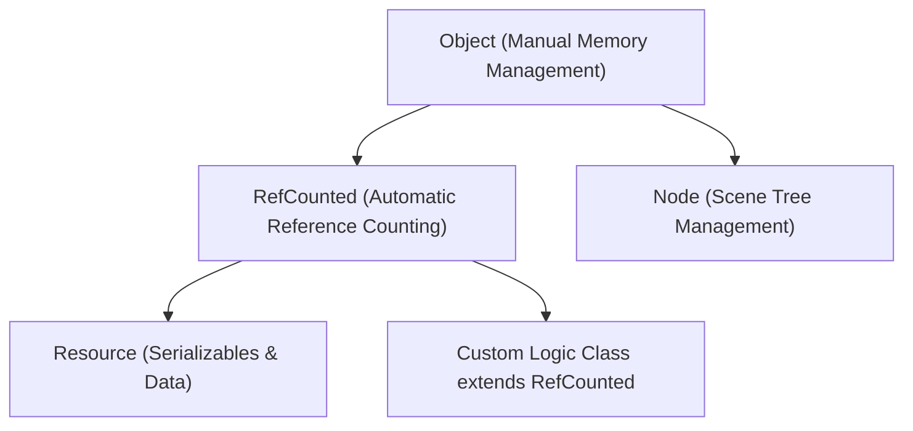

# Memory & Lifecycle Management in Godot 4.7

Understanding Godot's dual memory model is critical to avoid memory leaks, crashes, and dangling pointers.

---

## 1. The Dual Memory Model: `RefCounted` vs `Object`/`Node`

Godot divides all heap instances into two fundamental memory categories:



### 1.1 `RefCounted` (Automatic Deallocation)
* Base class: `RefCounted` (which `Resource` inherits from).
* **Behavior:** Keeps an internal reference counter. When the last reference to the instance goes out of scope or is set to `null`, Godot automatically frees it from memory.
* **Usage:** Data containers, custom mathematical structures, items, inventory slots.
* **Never call `free()` on a `RefCounted` instance!** It is managed automatically.

```gdscript
# Custom data class: auto-freed when no longer referenced
class_name ItemData extends RefCounted

var item_name: String = ""
var quantity: int = 1
```

### 1.2 `Node` & `Object` (Manual Deallocation)
* Base classes: `Object` $\rightarrow$ `Node` $\rightarrow$ `CanvasItem` / `Node3D` / `Control`.
* **Behavior:** Nodes are **NOT** reference counted. They persist until explicitly deleted or until their parent node is freed.
* **Usage:** Visual elements, physics bodies, camera, audio players, timers.

---

## 2. Freeing Nodes: `queue_free()` vs `free()`

| Method | Behavior | When to Use |
| :--- | :--- | :--- |
| **`queue_free()`** (Preferred) | Safely schedules the node to be removed and freed at the end of the current frame (idle time). | **Always use this for nodes in the Scene Tree.** Prevents crashes if signals or physics processes are currently inspecting the node. |
| **`free()`** (Immediate) | Destroys the object immediately. | Use **only** on detached `Object` instances that were never added to the SceneTree. Calling this during physics/signals causes crashes. |

```gdscript
# Safe node destruction
func destroy_enemy(enemy: Node2D) -> void:
    # Safely detach and free at frame end
    enemy.queue_free()
```

---

## 3. Detecting Dangling Pointers: `is_instance_valid()`

When an `Object` or `Node` is freed, variables holding references to it do NOT automatically become `null`. Instead, they point to dead memory (a dangling pointer).

Checking `if my_node == null:` will evaluate to `false` for a freed object! You **must** use `is_instance_valid()`:

```gdscript
var tracked_target: Node2D = null

func check_target() -> void:
    # INCORRECT: May crash or fail if target was queue_free()'d
    # if tracked_target != null:
    #     tracked_target.global_position = ...

    # CORRECT: Robust check for freed objects
    if is_instance_valid(tracked_target):
        print("Target is alive at: %s" % tracked_target.global_position)
    else:
        tracked_target = null
        print("Target is gone or never assigned.")
```

---

## 4. Weak References (`weakref`)

If two `RefCounted` objects reference each other cyclically (Object A holds Object B, and Object B holds Object A), their reference counters will never reach zero, causing a silent memory leak.

Use `weakref()` to break cyclic references:

```gdscript
var _target_weak_ref: WeakRef

func set_target(target: Object) -> void:
    _target_weak_ref = weakref(target)

func use_target() -> void:
    var target = _target_weak_ref.get_ref()
    if target:
        target.do_something()
```
