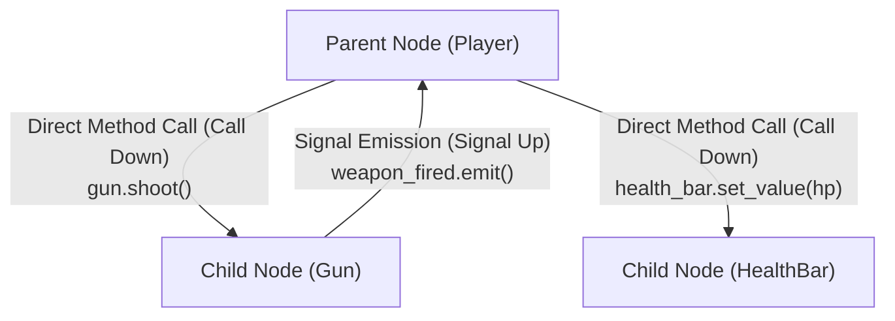

# Node Communication Principles: "Call Down, Signal Up"

This document establishes the canonical architectural design patterns for node communication in Godot projects.

---

## 1. The Core Invariant: "Call Down, Signal Up"

The golden rule of Godot scene architecture is:
* **Parents call methods DOWN on their children.**
* **Children emit signals UP to their parents.**



### Why this rule is essential:
1. **Encapsulation:** A child node should never know who its parent is. If a child node executes `get_parent().add_score(10)`, you can never reuse that child in another scene without crashing.
2. **Reusability:** By emitting `signal score_awarded(points: int)`, the child can be placed anywhere. The parent decides how to handle the score.

```gdscript
# ANTI-PATTERN (Fragile - tight coupling to specific parent):
func _on_enemy_killed() -> void:
    get_parent().get_parent().get_node("HUD/ScoreLabel").update_score(10)

# CANONICAL PATTERN (Clean & decoupled):
# Inside Enemy.gd:
signal enemy_died(score_value: int)

func _die() -> void:
    enemy_died.emit(10)
    queue_free()

# Inside Level.gd (Parent):
func _on_enemy_spawned(enemy: Enemy) -> void:
    enemy.enemy_died.connect(_on_enemy_died)

func _on_enemy_died(points: int) -> void:
    score += points
    hud.update_score(score)
```

---

## 2. Cross-Scene Communication: Groups

When multiple unrelated nodes across the tree need to receive an instruction or be queried together, use **Groups**.

### 2.1 Querying & Notifying Groups
```gdscript
# Add node to group in code (or configure in Godot Node tab -> Groups dock)
func _ready() -> void:
    add_to_group("enemies")

# Broadcast a method call to all group members across the entire scene tree
func trigger_nuke() -> void:
    get_tree().call_group("enemies", "take_damage", 999.0)

# Query all nodes in a group
func get_closest_enemy() -> Node2D:
    var enemies := get_tree().get_nodes_in_group("enemies")
    if enemies.is_empty():
        return null
    return enemies[0] as Node2D
```

---

## 3. Global Communication: Autoloads (Singletons)

Autoloads are singletons instantiated at the root of the SceneTree before any scene loads.

### 3.1 When to Use an Autoload
* Global **Event Bus** (e.g. `EventBus.player_died.emit()`).
* Persistent game state managers (e.g. `SaveManager`, `AudioManager`, `SceneTransitionManager`).

### 3.2 When NOT to Use an Autoload
* Never store local scene logic in an Autoload.
* Never use Autoloads as a dumping ground for global variables that should belong to the active level or character.
