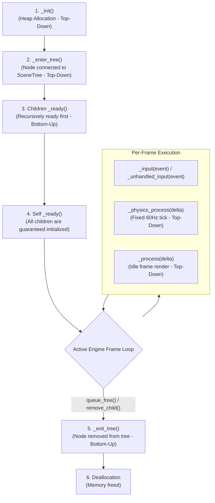

# Node Lifecycle & Execution Flow (Godot 4.7)

Understanding the exact sequence in which Godot instantiates, adds, processes, and removes nodes is essential to avoid `null` reference errors and race conditions.

---

## 1. Complete Node Lifecycle Order

---

## 2. Detailed Method Specifications

### 2.1 `_init()` (Constructor)
* **Direction:** Top-Down (Parent initializes before children).
* **Environment:** The node is created in memory but is **NOT** yet in the `SceneTree`.
* **Rules:**
  * `$ChildNode` does **NOT** exist yet. Accessing children here will crash.
  * `get_tree()` returns `null`.
  * Use strictly for setting primitive variables and initializing heap data structures.

### 2.2 `_enter_tree()`
* **Direction:** Top-Down (Parent enters before children).
* **Environment:** The node has just been attached to a parent inside the active `SceneTree`.
* **Rules:**
  * `get_tree()` is now valid.
  * Children may not yet be in the tree.

### 2.3 `_ready()` (Initialization)
* **Direction:** **Bottom-Up (Children ready BEFORE their parents).**
* **Environment:** All child nodes have already finished their own `_ready()` calls and are fully accessible.
* **Rules:**
  * `@onready` variables are resolved immediately prior to entering this method.
  * Safe to call methods on children, connect signals, and fetch `%UniqueNodes`.
  * Triggered only **once** in a node's lifetime (unless `request_ready()` is called).

### 2.4 `_process(delta: float)` vs `_physics_process(delta: float)`
* **Direction:** Top-Down (Parents process before children).

| Feature | `_process(delta)` | `_physics_process(delta)` |
| :--- | :--- | :--- |
| **Frequency** | Variable (tied to monitor refresh rate / FPS). | Fixed rate (default: `60Hz`, configured in Project Settings). |
| **Use Case** | UI updates, cosmetic camera smoothing, animations, visual tweens. | Character physics, raycasting, velocity calculations, collision checks. |
| **Delta Parameter** | Elapsed time in seconds since previous visual frame. | Constant physics tick interval (e.g. `1.0 / 60.0 = 0.01666s`). |

> [!IMPORTANT]
> Never calculate game physics, `move_and_slide()`, or velocity integration inside `_process()`. Always place physics code inside `_physics_process()`.

### 2.5 `_exit_tree()` (Cleanup)
* **Direction:** Bottom-Up (Children exit before parents).
* **Environment:** Node is being removed from the tree.
* **Rules:**
  * Disconnect external signals, clean up persistent global state references, stop audio streams.
