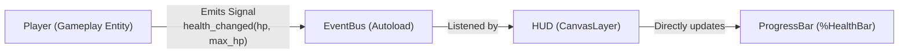

# Decoupling UI from Gameplay Logic

In clean Godot architecture, gameplay entities (Player, Enemies, Inventory) should **never** directly reach into or control UI nodes.

---

## 1. The Anti-Pattern: Tight UI Coupling

```gdscript
# ANTI-PATTERN (Fragile - Breaks if HUD is removed or renamed):
# Inside Player.gd:
func take_damage(amount: float) -> void:
    health -= amount
    get_tree().root.get_node("Main/CanvasLayer/HUD/HealthBar").value = health
    get_tree().root.get_node("Main/CanvasLayer/HUD/DamageEffect").play("flash")
```

### Problems with tight coupling:
1. If the Player is tested in isolation (pressing `F6` on `Player.tscn`), the game crashes immediately with a `null` reference.
2. The Player scene cannot be reused in another level without duplicating the exact HUD hierarchy.

---

## 2. Canonical Decoupled Architecture



### 2.1 Implementation with an Event Bus

#### `event_bus.gd` (Autoload Singleton):
```gdscript
extends Node

signal player_health_changed(current: float, maximum: float)
signal player_score_changed(new_score: int)
```

#### `player.gd` (Gameplay):
```gdscript
func take_damage(amount: float) -> void:
    health = max(0.0, health - amount)
    # Notify the world through the event bus
    EventBus.player_health_changed.emit(health, max_health)
```

#### `hud.gd` (UI Script attached to `CanvasLayer`):
```gdscript
class_name GameHUD
extends CanvasLayer

@onready var health_bar: ProgressBar = %HealthBar

func _ready() -> void:
    # Connect to the global event bus
    EventBus.player_health_changed.connect(_on_player_health_changed)

func _on_player_health_changed(current: float, maximum: float) -> void:
    health_bar.max_value = maximum
    health_bar.value = current
```

---

## 3. CanvasLayer for UI Rendering

Always place user interfaces inside a `CanvasLayer` node:
* `CanvasLayer` ensures UI elements render in screen-space, unaffected by 2D Camera zoom, rotation, or 3D world projections.
* `layer = 1`: Standard HUD layer (renders above gameplay).
* `layer = 100`: Modal pause menus and dialogs (renders above all HUDs).
