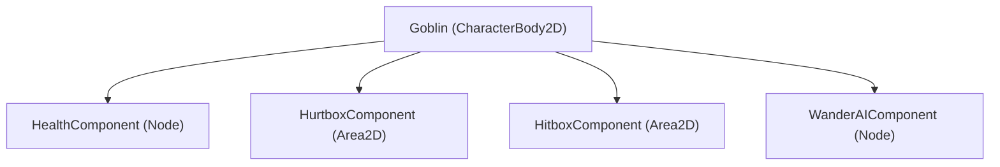

# Composition over Inheritance in Godot 4.7

Godot's node hierarchy is uniquely suited for **Component-Based Composition**. Deep class inheritance hierarchies (`Node2D -> Entity -> LivingEntity -> Combatant -> Monster -> Goblin`) quickly become rigid and fragile.

---

## 1. The Component Pattern

Instead of inheriting behavior, assemble functionality by attaching specialized child nodes (Components).



---

## 2. Practical Component Implementation

### 2.1 `HealthComponent.gd`
```gdscript
class_name HealthComponent
extends Node

signal health_changed(new_health: float, max_health: float)
signal died

@export var max_health: float = 100.0
var current_health: float

func _ready() -> void:
    current_health = max_health

func damage(amount: float) -> void:
    current_health = max(0.0, current_health - amount)
    health_changed.emit(current_health, max_health)
    if current_health <= 0.0:
        died.emit()

func heal(amount: float) -> void:
    current_health = min(max_health, current_health + amount)
    health_changed.emit(current_health, max_health)
```

### 2.2 `HitboxComponent.gd` (Deals Damage)
```gdscript
class_name HitboxComponent
extends Area2D

@export var damage: float = 10.0
```

### 2.3 `HurtboxComponent.gd` (Receives Damage)
```gdscript
class_name HurtboxComponent
extends Area2D

@export var health_component: HealthComponent

func _ready() -> void:
    area_entered.connect(_on_area_entered)

func _on_area_entered(area: Area2D) -> void:
    if area is HitboxComponent and health_component:
        health_component.damage(area.damage)
```

---

## 3. Why This Wins
* You can attach `HealthComponent` to an Enemy, a Player, a Breakable Pot, or a Wooden Crate.
* None of them share a common base class beyond `Node2D` or `Node3D`.
* If a Crate doesn't move, it doesn't need a `CharacterBody2D` base class!
