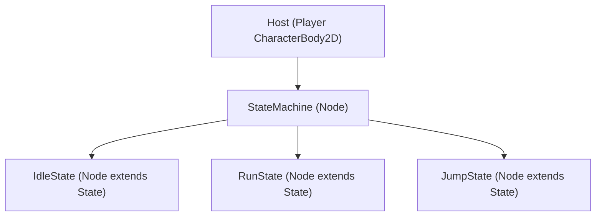

# Node-Based Finite State Machine (FSM) Pattern

This document provides the standard, modular node-based Finite State Machine pattern for Godot 4.7.

---

## 1. Architecture



---

## 2. Implementation

### 2.1 `State.gd` (Base Class)
```gdscript
class_name State
extends Node

## Emitted when requesting a transition to a new state by name.
signal transitioned(new_state_name: StringName)

var actor: CharacterBody2D

func enter() -> void:
    pass

func exit() -> void:
    pass

func update(_delta: float) -> void:
    pass

func physics_update(_delta: float) -> void:
    pass
```

### 2.2 `StateMachine.gd` (Manager)
```gdscript
class_name StateMachine
extends Node

@export var initial_state: State

var current_state: State
var states: Dictionary[StringName, State] = {}

func _ready() -> void:
    var parent_actor := get_parent() as CharacterBody2D
    
    for child in get_children():
        if child is State:
            states[child.name] = child
            child.actor = parent_actor
            child.transitioned.connect(_on_child_transitioned)
            
    if initial_state:
        initial_state.enter()
        current_state = initial_state

func _process(delta: float) -> void:
    if current_state:
        current_state.update(delta)

func _physics_process(delta: float) -> void:
    if current_state:
        current_state.physics_update(delta)

func _on_child_transitioned(new_state_name: StringName) -> void:
    var new_state: State = states.get(new_state_name)
    if not new_state or new_state == current_state:
        return
        
    current_state.exit()
    new_state.enter()
    current_state = new_state
```

### 2.3 `IdleState.gd` (Concrete State Example)
```gdscript
class_name IdleState
extends State

func enter() -> void:
    actor.velocity.x = 0.0

func physics_update(_delta: float) -> void:
    if not actor.is_on_floor():
        transitioned.emit(&"FallState")
        return
        
    if Input.get_axis("move_left", "move_right") != 0.0:
        transitioned.emit(&"RunState")
        return
        
    if Input.is_action_just_pressed("jump"):
        transitioned.emit(&"JumpState")
```
